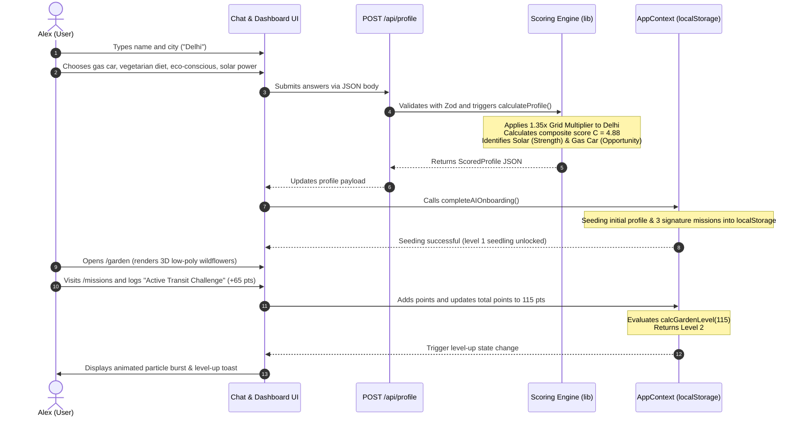
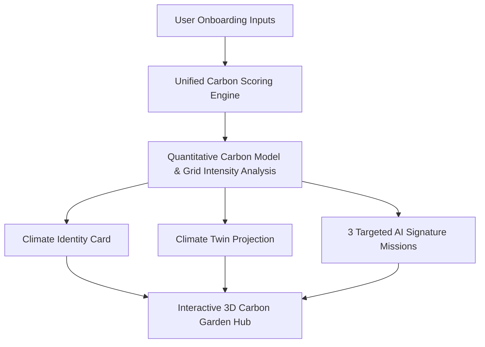

# GreenPath AI 🌱

> **An AI-driven personal climate companion that transforms carbon footprint data into personalized stories, targeted missions, and a living 3D garden.**

---

## 🚨 THE PROBLEM

### Climate action is hard — and existing tools make it harder

Climate change is the defining challenge of our era, yet **most people feel powerless**. The knowing–doing gap is massive: 79% of people say they want to act on climate, but fewer than 30% make lasting behavioral changes (Yale Program on Climate Change Communication, 2023).

**Why do people give up?**

### Why Existing Solutions Fail

| Problem | How It Manifests |
|---|---|
| **Generic recommendations** | "Eat less meat, drive less" — advice everyone already knows |
| **No personalization** | Same tips for someone in Oslo (clean grid) as Delhi (coal grid) |
| **Measurement without action** | Calculators produce a number, then leave users stranded |
| **Weak engagement loops** | No feedback, no rewards, no reason to return tomorrow |
| **Overwhelming complexity** | Showing 50 tips causes decision fatigue and zero action |
| **No emotional connection** | Data tables don't motivate — stories do |

---

## 🧠 WHY AI IS NEEDED

Static tools fail because human behavior is not one-size-fits-all. A traditional carbon calculator treats a resident in Seattle (92% hydro-powered grid) the same as a resident in Beijing (60% coal-powered grid). 

**GreenPath AI utilizes a deterministic Expert AI Decision Engine to solve this:**
1. **Dynamic Grid Calibration**: Location is a primary indicator. Clover adjusts household energy footprints by applying real-world carbon intensity scaling factors to the user's city grid mix.
2. **Cognitive Overhead Reduction**: Instead of dumping a static list of 50 chores on the user, the AI engine surfaces exactly **three high-impact, targeted signature missions** mapping to the user's weakest lifestyle area.
3. **Emotional Connection**: By translating raw carbon weights into a structured, narrative-driven **Climate Identity Archetype**, the system builds an immediate personal connection that encourages active participation.

---

## ✅ THE GREENPATH AI SOLUTION

GreenPath AI solves the knowing–doing gap through three interconnected systems:

### 1. 🤖 Clover — Your Personal AI Carbon Coach
Clover is not a generic chatbot. Clover is a **personalized climate intelligence layer** that:
- Conducts a 6-question conversational audit (not a form)
- Applies your city's real electricity grid intensity to calibrate scoring
- Generates a unique **Climate Identity Archetype** narrative just for you
- Selects exactly 3 missions targeting your highest-impact area first

### 2. 🌍 Climate Twin Forecasting
Your Climate Twin is a simulated future version of you that shows what happens if you follow Clover's plan:
- Projects annual CO₂ savings in kg
- Converts to relatable equivalents: flights avoided, months of home power saved, trees nourished
- Interactive sliders let you experiment with different behavioral changes in real time

### 3. 🌱 Carbon Garden — Gamified Progress
Your Carbon Garden is a **living 3D diorama** that evolves as you log eco-actions:
- Level 0 → barren land (0 pts)
- Level 1 → lush wildflowers (50 pts)
- Level 2 → young sprout (120 pts)
- Level 3 → mature tree (200 pts)
- Level 4 → young forest (300 pts)
- Level 5 → thriving ecosystem (450 pts)

Every logged action fires instant visual feedback — particle bursts, point counters, garden level-up animations — creating an **immediate reward loop** that encourages the next action.

---

## 🧠 HOW THE AI ENGINE PERSONALIZES RECOMMENDATIONS

GreenPath AI's scoring engine (`scoring-engine.ts`) is a deterministic, rule-based AI system that processes user inputs through 8 sequential steps to produce completely personalized outputs. **No two users with different answers ever receive the same profile.**

### Step-by-Step Decision Pipeline

```
User Answers (City + 4 Lifestyle Habits)
         ↓
Step 1:  City Grid Intensity Multiplier
         (Delhi: ×1.35 coal-heavy | Oslo: ×0.35 clean-energy | others: ×1.0 neutral)
         ↓
Step 2:  Per-Category Score Lookup (0–10 normalized scale)
         Transport / Food / Energy / Shopping
         ↓
Step 3:  Weighted Composite Impact Index
         C = Transport×0.35 + Food×0.30 + Energy×0.20 + Shopping×0.15
         ↓
Step 4:  Strength & Opportunity Identification
         Lowest score = Strength category | Highest score = Opportunity category
         ↓
Step 5:  Identity Archetype Composition
         Combined title: "[Strength Title] & [Opportunity Auditor]"
         Extremes: C ≤ 1.8 → "Green Earth Champion" | C ≥ 8.5 → "Green Path Beginner"
         ↓
Step 6:  Deterministic Narrative Generation
         City name hashed → stable clause selection → unique but reproducible story
         ↓
Step 7:  Climate Twin Projection (35% baseline reduction target)
         Flights = savedKg ÷ 350 | Power months = savedKg ÷ 450 | Trees = savedKg ÷ 22
         ↓
Step 8:  Mission Selection (3 missions from worst category + best category)
         1 Hard mission (worst category) + 1 Medium mission (worst category) + 1 Easy mission (best category)
```

### Why the Weights Are What They Are

| Category | Weight | Source |
|---|---|---|
| Transport | 35% | IEA 2022: personal transport is the largest individual carbon contributor |
| Food | 30% | Poore & Nemecek (2018, Science): animal agriculture = 26% of global emissions |
| Energy | 20% | US EIA: home energy = ~20% of household carbon footprint |
| Shopping | 15% | WRAP UK: consumption lifecycle = smallest but growing due to e-commerce |

---

## 👤 REAL USER JOURNEY — THREE EXAMPLE PERSONAS

The following examples demonstrate how **the same system produces completely different outputs** for different users — proving this is a genuine personalization engine, not a static calculator.

---

### Persona A — "The Delhi Driver"
**Inputs:**
- City: **Delhi** (coal-heavy grid → multiplier 1.35×)
- Transport: **Gas car** (drive alone)
- Diet: **Meat-heavy**
- Shopping: **Frequent buyer**
- Energy: **High AC / heating**

**AI Analysis:**
```
Transport score:  10.0  (gas car = 4,600 kg/yr)
Food score:       10.0  (meat-heavy = 2,900 kg/yr)
Energy score:     10.0  (high_ac 3.5 × 1.35 = capped at 10.0; 3,500 kg/yr × 1.35 = 4,725)
Shopping score:   10.0  (frequent = 2,200 kg/yr)
Grid multiplier:  1.35× (coal-heavy Delhi power grid)
Composite C:      10.0
Total baseline:   ~15,400 kg CO₂/yr
```

**Output:**
- **Identity:** *"Green Path Beginner"* (composite ≥ 8.5 override)
- **Story:** *"Living in Delhi, your home is powered by a coal-heavy city power grid. [Tension clause for transport]. However, your travel habits are the biggest source of energy use in your profile. Your habits use a lot of energy right now. Making a few simple, daily shifts will help save a huge amount of power over time."*
- **Climate Twin:** Saving 35% → ~5,390 kg saved → **15 flights avoided**, **12 months of home power**, **245 trees**
- **Missions:** Active Transit Challenge (hard, transport) + Public Transit Day (medium, transport) + Reusable Bag Routine (easy, shopping)

---

### Persona B — "The Oslo Eco-Commuter"
**Inputs:**
- City: **Oslo** (clean hydro/wind grid → multiplier 0.35×)
- Transport: **Walk or bike**
- Diet: **Vegan**
- Shopping: **Minimalist**
- Energy: **Standard home grid**

**AI Analysis:**
```
Transport score:  0.0   (walk/bike = 0 kg/yr)
Food score:       1.7   (vegan = 500 kg/yr)
Energy score:     5.4 × 0.35 = 1.89  (standard grid heavily reduced by clean Oslo grid)
Shopping score:   1.4   (minimalist = 300 kg/yr)
Grid multiplier:  0.35× (clean wind + hydro Oslo grid)
Composite C:      0.35×(0)+0.30×(1.7)+0.20×(1.89)+0.15×(1.4) = 0+0.51+0.378+0.21 = 1.10
Total baseline:   ~1,465 kg CO₂/yr
```

**Output:**
- **Identity:** *"Green Earth Champion"* (composite ≤ 1.8 override)
- **Story:** *"Living in Oslo, your home is powered by a clean wind and water power grid. Your food choices help avoid high-emissions meat production... With an amazing green score, you are already a hero for the earth!"*
- **Climate Twin:** Saving 35% → ~513 kg saved → **1 flight avoided**, **1 month of home power**, **23 trees**
- **Missions:** Kill Vampire Power (easy, energy) + Thermostat Setback (medium, energy) + Peak Grid Reduction (hard, energy)

---

### Persona C — "The Mumbai Flexitarian"
**Inputs:**
- City: **Mumbai** (coal-heavy grid → multiplier 1.35×)
- Transport: **Public transit**
- Diet: **Balanced flexitarian**
- Shopping: **Eco-conscious**
- Energy: **Smart home setup**

**AI Analysis:**
```
Transport score:  2.0   (transit = 900 kg/yr)
Food score:       5.9   (balanced = 1,700 kg/yr)
Energy score:     3.1 × 1.35 = 4.19  (smart_home amplified by coal-heavy Mumbai grid)
Shopping score:   4.5   (conscious = 1,000 kg/yr)
Grid multiplier:  1.35× (coal-heavy Mumbai power grid)
Composite C:      2.0×0.35 + 5.9×0.30 + 4.19×0.20 + 4.5×0.15 = 0.70+1.77+0.84+0.68 = 4.0
Total baseline:   ~5,859 kg CO₂/yr (1.35 applied to energy raw)
```

**Output:**
- **Identity:** *"Green Commuter & Food Improver"* (strength=transport, opportunity=food)
- **Story:** *"Living in Mumbai, your home is powered by a coal-heavy city power grid. Getting around without a car saves energy and helps clean city air. However, eating meat frequently uses a high amount of land and water resources. You have great daily habits! Focus on a few easy improvements to make an even bigger difference."*
- **Climate Twin:** Saving 35% → ~2,051 kg saved → **5 flights avoided**, **4 months of home power**, **93 trees**
- **Missions:** Locally Sourced Week (hard, food) + Zero-Waste Plant Meal (medium, food) + Carpool Commute (easy, transport)

---

## 🌿 CLIMATE TWIN WALKTHROUGH

The Climate Twin system operates two independent, mathematically rigorous models:

### 1. The Onboarding Baseline Projection (`scoring-engine.ts`)
This establishes a **35% carbon reduction target** based on scientific guidelines.
```
Baseline Annual CO₂ = transport_kg + food_kg + (energy_kg × gridMultiplier) + shopping_kg
Target Saved Kg = round(Baseline × 35%)
```
Equivalents are converted using standard climate indicators:
* **Flights Avoided**: `max(1, round(TargetSavedKg / 350))` (Reference: ~350kg CO₂ per short-haul domestic flight)
* **Power Months Saved**: `max(1, round(TargetSavedKg / 450))` (Reference: ~450kg CO₂ per average household electricity month)
* **Trees Equivalent**: `max(10, round(TargetSavedKg / 22))` (Reference: ~22kg CO₂ sequestered per mature tree per year)

### 2. The Interactive Slider Simulator (`ClimateTwinView.tsx`)
Located on `/analysis`, this lets the user manually configure transit, diet, energy, and shopping sliders (0–100%) to model custom futures:
```
Projected Carbon Saved = (TransitSlider / 100 × 1200) + (DietSlider / 100 × 600) + (EnergySlider / 100 × 450) + (ShoppingSlider / 100 × 300)
```
Simulated equivalents are calculated dynamically:
* **Flights Avoided**: `ProjectedSaved / 250` (Reference: Delhi-Mumbai roundtrip flight ≈ 250kg CO₂)
* **Power Months Saved**: `ProjectedSaved / 120` (Reference: Average local household month grid power ≈ 120kg CO₂)
* **Tree Equivalents**: `ProjectedSaved / 21` (Reference: Mature tree absorption rate ≈ 21kg CO₂/year)

Dragging the sliders feeds directly into a linear color interpolation filter that transforms the 3D-feeling planet map from a dusty sepia/gray hue to vibrant emerald green in real time.

---

## 👤 END-TO-END USER LIFE CYCLE

Here is how a single user ("Alex") moves through the entire system:



---

## 🎯 PERSONALIZED MISSIONS SYSTEM

Clover doesn't show 50 tips. Clover surfaces **exactly 3 missions** — enough to be actionable, not enough to be overwhelming.

**Mission Selection Logic:**
1. Identify the user's **worst category** (highest composite score)
2. Assign the **Hard** and **Medium** missions from that category's pool
3. Identify the user's **best category** (lowest composite score)
4. Assign the **Easy** mission from that category's pool (to reinforce existing good habits)

**Mission Library (12 templates, 3 per category × 4 categories):**

| Category | Easy | Medium | Hard |
|---|---|---|---|
| Transport | Carpool Commute (1.5kg) | Public Transit Day (3.8kg) | Active Transit Challenge (7.2kg) |
| Food | One Meatless Lunch (1.2kg) | Zero-Waste Plant Meal (2.8kg) | Locally Sourced Week (5.8kg) |
| Energy | Kill Vampire Power (0.8kg) | Thermostat Setback (2.5kg) | Peak Grid Reduction (6.0kg) |
| Shopping | Reusable Bag Routine (0.5kg) | Second-Hand Swap (2.2kg) | Zero Packaging Sourcing (5.0kg) |

Beyond AI Signature Missions, users also unlock **Daily Eco-Actions** (8 rotating actions, ~25 pts each) and **Weekly Challenges** (1 per week, 100 pts) to maintain engagement.

---

## 🏗️ TECHNICAL ARCHITECTURE

```
├── public/                    # Static assets (compressed nature backgrounds)
├── src/
│   ├── app/                   # Next.js App Router routes
│   │   ├── page.tsx           # / (Landing page)
│   │   ├── onboarding/        # /onboarding — Clover conversational questionnaire
│   │   │   ├── page.tsx       # Main page orchestrator (state machine, API call)
│   │   │   ├── onboarding-data.ts  # Static questions, options, reaction variants
│   │   │   ├── LoadingStep.tsx     # Generation loading screen sub-component
│   │   │   ├── RevealStep.tsx      # 4-screen cinematic reveal sub-component
│   │   │   ├── ChatStep.tsx        # Conversational chat screen layout sub-component
│   │   │   ├── WordReveal.tsx      # Staggered typewriter word-reveal sub-component
│   │   │   └── audio-utils.ts      # Client-side arpeggio synthesizer utility
│   │   ├── garden/            # /garden — 3D Carbon Garden diorama
│   │   ├── missions/          # /missions — Mission logging hub
│   │   │   ├── page.tsx       # Main missions controller
│   │   │   ├── GardenPreviewPanel.tsx  # Sticky garden diorama progress tracker
│   │   │   ├── SignatureMissionsList.tsx # Custom AI signature missions lists
│   │   │   └── EcoActionsList.tsx  # Standard eco action cards
│   │   ├── analysis/          # /analysis — Climate Twin simulator
│   │   │   └── ClimateTwinView.tsx # Interactive twin slider component
│   │   ├── identity/          # /identity — Full profile card
│   │   └── api/profile/       # POST /api/profile — Zod-validated scoring endpoint
│   ├── components/
│   │   ├── garden/            # React Three Fiber 3D low-poly diorama scenes
│   │   ├── shared/            # Navigation, Counter, PageBackground, ResetButton
│   │   └── ui/                # Primitive UI components (cards, buttons, sliders)
│   ├── data/                  # Static data pools (missions, identities, daily actions)
│   ├── hooks/                 # Custom React hooks (useWindowSize, etc.)
│   ├── lib/
│   │   ├── scoring-engine.ts  # ⭐ Core AI scoring engine (8-step pipeline)
│   │   ├── ai-engine.ts       # TypeScript contracts for AI profile data
│   │   ├── category-utils.tsx # Shared icon/emoji/badge utilities
│   │   └── constants.ts       # Garden level thresholds (single source of truth)
│   └── store/
│   │   └── AppContext.tsx     # React Context + localStorage state management
│   └── vitest.config.ts       # Test runner config (JSDOM environment)
└── playwright.config.ts       # E2E test config
```

**Key Design Decisions:**
- **No external AI API calls** — the scoring engine runs entirely server-side at `/api/profile` using Zod validation. This guarantees deterministic, sub-100ms response times with zero API cost.
- **City-aware scoring** — grid intensity is baked into the scoring formula, making location a first-class signal rather than flavor text.
- **Deterministic narratives** — `selectIndex` hashes the city name to always produce the same story variant for the same answers (reproducible, not random).
- **Single-session architecture** — localStorage state means judges can experience the complete arc (onboarding → garden level 5) in one browser session, without signup friction.

---

## ═══ HACKATHON EVALUATION MATRIX ═══

### Challenge Vertical & Persona
- **Hackathon Vertical:** Interactive Sustainability & Ecological Gamification
- **Core Persona:** Clover, the AI Carbon Coach — supportive, encouraging, optimistic

### Decision Logic & Architecture
The system uses a unified carbon-scoring engine (`scoring-engine.ts`) on the server backend:


**Scientific Scoring Formulas:**
- **Grid Multiplier:** Coal-heavy cities (Delhi/Mumbai/Beijing/Sydney/Johannesburg) → ×1.35; Clean-energy cities (Oslo/Seattle/Vancouver/Stockholm/Copenhagen) → ×0.35; All others → ×1.0
- **Composite:** `C = Transport×0.35 + Food×0.30 + Energy×0.20 + Shopping×0.15`
- **Twin Savings:** Baseline CO₂ reduced by 35%; converted to flights (÷350 kg), power months (÷450 kg), trees (÷22 kg/yr)

---

## 🚀 QUICK DEMO PATH (for reviewers)

**Time to complete: ~3 minutes**

1. Visit `/onboarding` — Clover greets you with 6 questions:
   - **Name** — e.g. "Alex"
   - **City** — try **"Delhi"** (coal-heavy scoring) or **"Oslo"** (clean-grid scoring) to see different results
   - **Transport** — Walk/Bike, Transit, Electric Car, or Gas Car
   - **Diet** — Vegan, Vegetarian, Balanced, or Meat Heavy
   - **Shopping** — Minimalist, Eco-Conscious, or Frequent Buyer
   - **Home Energy** — Solar, Smart Setup, Standard Grid, or High AC
2. Watch the **4-step cinematic reveal**: Identity Archetype → Carbon Story → Climate Twin projections → 3 Signature Missions
3. Click **"Enter My Carbon Garden"** → 3D diorama appears at Level 1
4. Visit `/missions` → log **3–4 actions** → watch points update live and garden level rise
5. Visit `/analysis` → drag the **Climate Twin sliders** to model behavioral changes in real time
6. Visit `/identity` → see your complete AI-generated profile card with strength/opportunity analysis
7. Use the floating **Reset Demo** button to restart for a different city persona

---

## 🧪 TESTING & QUALITY

**117 tests across 12 test files** covering:
- Unit: scoring math, grid multipliers, narrative determinism, Zod validation, XSS sanitization
- Integration: AppContext state transitions, mission idempotency, garden level thresholds
- Accessibility: axe WCAG compliance on every page component
- E2E: Playwright lifecycle flow (onboarding → missions → garden)

```bash
npm run test          # Unit + integration (Vitest)
npm run test -- --coverage  # With coverage report
npx playwright test   # E2E (Playwright)
npm run build         # Production build verification
npm run lint          # ESLint check
```

**Core Module Coverage:**
- `scoring-engine.ts` — 100% statement, 100% function, 97.36% branch
- `constants.ts` — 100% all metrics
- `utils.ts` — 100% all metrics

---

## 🌐 PRODUCTION ROADMAP

| Feature | Hackathon State | Production Path |
|---|---|---|
| **Auth & Persistence** | Client `localStorage` only | Supabase Auth + PostgreSQL profile database |
| **AI Scoring** | Rule-based deterministic engine | Hybrid: scoring engine + LLM narrative generation (Gemini 2.0 Flash) |
| **City Grid APIs** | 10 hardcoded grid-intensity cities | Real-time EIA/IEA API integration for dynamic grid carbon intensity by city |
| **Mission Library** | 12 templates across 4 categories | Dynamic pool of 200+ localized missions with community contributions |
| **Garden Sharing** | None | HTML5 Canvas snapshots for direct social media sharing cards |
| **Streak System** | Disabled (always 0 bonus) | Consecutive daily log multipliers to encourage long-term retention |
| **Push Notifications** | None | Daily scheduling nudges via Web Push API |
| **Accessibility** | WCAG AA (axe verified) | WCAG AAA target with full screen-reader-optimised 3D garden fallback |

---

## 🛠️ TECH STACK

- **Framework:** Next.js 16 (TypeScript, App Router)
- **3D Graphics:** React Three Fiber + Drei + Three.js
- **Animations:** Framer Motion
- **AI Core:** Rule-based dynamic scoring & personalized storytelling engine (server-side, zero API cost)
- **Testing:** Vitest (unit/integration) + Playwright (E2E) + jest-axe (accessibility)
- **Icons:** Lucide React
- **Validation:** Zod (API schema enforcement + XSS sanitization)

---

## 🏃 GETTING STARTED

```bash
npm install
npm run dev
# → Open http://localhost:3000
```
